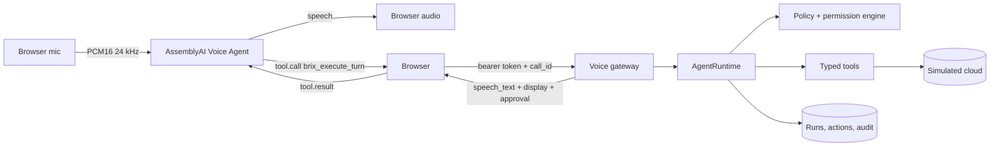

# InfraBrix Voice

**Talk to your on-call DevOps agent.** Ask it what's broken, and it investigates your production
environment with typed tools and tells you, out loud, what happened and how to fix it. If the fix
changes infrastructure, it prepares the change and waits for you to approve it on screen.
Saying "yes" never changes anything.

Built on the [AssemblyAI Voice Agent API](https://www.assemblyai.com/) for the AssemblyAI Voice Agent
Hackathon (lablab.ai, September 2026).

This repository is the open-source voice layer of **[InfraBrix](https://infrabrix.enylabs.com/)**, an
autonomous DevOps product. The
voice pipeline, agent runtime, policy engine, approval gate and audit trail here are the real design.
The cloud they operate on is **simulated**, so anyone can run the full demo locally with one API key.

## The demo

Your `checkout-api` started failing after the last deploy.

1. Press **Start Voice Mode** and ask *"What's wrong with production?"*
2. Brix runs `diagnose_incident`, correlates the error spike with release `v42` ("Switch payment
   client to pooled async HTTP"), and says so.
3. Say *"Roll it back."* Brix prepares `rollback_release`, which is parked, not executed. An
   **Approve / Deny** card appears.
4. Click **Approve**. The rollback deploys, the card tracks recovery, and the service panel goes
   green. Every step is in the audit trail.
5. Ask *"How much are we spending this month?"* to see a cost anomaly. **Reset demo** replays the
   incident.

There's no microphone requirement: the typed chat under the orb uses the same runtime, the same
conversation, and the same approval gate.

## How it uses AssemblyAI



- **Server-minted temporary tokens.** `ASSEMBLYAI_API_KEY` never leaves the backend. The browser
  gets a short-lived, single-use token for `wss://agents.assemblyai.com/v1/ws`
  (`backend/app/providers/voice/assemblyai.py`).
- **Browser audio pipeline.** An `AudioWorklet` resamples the mic to PCM16 mono at 24 kHz
  (`frontend/public/voice/pcm-resampler.worklet.js`). Audio is only sent after `session.ready`.
  Reply audio is scheduled gaplessly, and `input.speech.started` stops playback immediately, so you
  can interrupt Brix mid-sentence.
- **One bridge tool.** The voice agent is configured (`session.update`) with exactly one tool,
  `brix_execute_turn(message)`. It never sees cloud, deploy, or rollback tools. Reasoning, tool
  choice and safety live in InfraBrix.
- **Reconnection.** Dropped sockets retry three times with 1s/2s/4s backoff. Each retry redeems a
  fresh token as a new voice session on the same conversation, and the mic and audio graph stay
  open.
- **Voice-first answers.** The agent returns a channel-independent result (`speech_text`, compact
  `display` events, `approval`), which the voice agent speaks and the UI renders.

## Security model

Voice makes an agent easier to use, and it must not make it easier to misuse. The rules, each
covered by tests in `backend/tests/`:

| Rule | Where |
|---|---|
| Identity, project and conversation come from the authenticated, owned voice session, never from speech, tool arguments, or model output | `api/voice.py`, `auth.py` |
| Risky tools (`write_infrastructure`, `destructive`) are parked as `pending_approval`, not run | `agent/runtime.py`, `agent/policies.py` |
| Only an explicit, authenticated click on a separate endpoint can approve. Speech can't reach it | `agent/voice_approvals.py` |
| Approvals are single-use (DB unique constraint), expire (10 min), and require an active session owned by the clicker | `models.py`, `voice_approvals.py` |
| Only allow-listed tools can run from the voice card | `INLINE_CONFIRMABLE_TOOLS` |
| Parked arguments are re-validated against the tool schema; redacted values are never executed | `voice_approvals.decide` |
| Provider tool calls are idempotent per `call_id` | `VoiceTurnRepository` |
| Ended sessions can't run turns or be resumed | `api/voice.py` |
| Telemetry accepts event codes only (`^[a-z0-9_.-]+$`). Transcripts are never written to audit | `api/schemas.py` |
| Secret-shaped values in tool args, results, or replies stop the run | `agent/guardrails.py` |

## Run it

You need an AssemblyAI API key for voice. Everything else is optional.

```bash
cp .env.example .env        # set ASSEMBLYAI_API_KEY
docker compose up --build
open http://localhost:3000
```

Without Docker:

```bash
# backend (Python 3.12+)
cd backend && python -m venv .venv && . .venv/bin/activate
pip install -e '.[dev]'
ASSEMBLYAI_API_KEY=... uvicorn app.main:app --port 8000

# frontend (Node 20+)
cd frontend && npm install && npm run dev
```

### Choosing the brain

`LLM_PROVIDER=scripted` (the default) is a deterministic offline planner. It maps a request to one
typed tool call and phrases the result, which keeps the demo free, fast and repeatable. For real
reasoning, set `LLM_PROVIDER` to `openai`, `openrouter`, `gemini` or `groq` with that provider's
key. Either way, calls go through the same runtime, policies, approval gate and audit trail.

## Tests

```bash
cd backend && pytest -q        # 34 tests: voice lifecycle, isolation, approvals, planner
cd frontend && npm run typecheck && npm run build
```

## Layout

```
backend/app/
  api/voice.py            voice gateway: sessions, turns, reconnect, telemetry, approvals
  agent/runtime.py        the one turn loop behind voice and text
  agent/voice_approvals.py  explicit approval gate + recovery tracking
  agent/policies.py       risk → run automatically or park for a human
  agent/tools.py          typed tools (6 read, 1 write)
  democloud.py            simulated cloud: services, releases, incident, metrics, cost
  providers/voice/        AssemblyAI temporary tokens
  providers/llm/          OpenAI-compatible provider + scripted planner
frontend/
  components/voice-mode.tsx  WebSocket, audio, tool bridge, approval card, reconnect
  components/voice-orb.tsx   canvas point-cloud orb that reacts to your voice
  public/voice/pcm-resampler.worklet.js
docs/architecture.md
```

## What's not here

The InfraBrix product also does repository analysis, architecture design, cost modelling, Terraform
generation and apply, CI/CD, and real AWS/GCP operations. None of that is in this repository.
`democloud.py` stands in for all of it behind the same tool interface.

## See it in the product

The same voice layer runs inside InfraBrix against real AWS infrastructure:
[infrabrix.enylabs.com](https://infrabrix.enylabs.com/).

## License

Apache-2.0. See [LICENSE](LICENSE) and [NOTICE](NOTICE).
