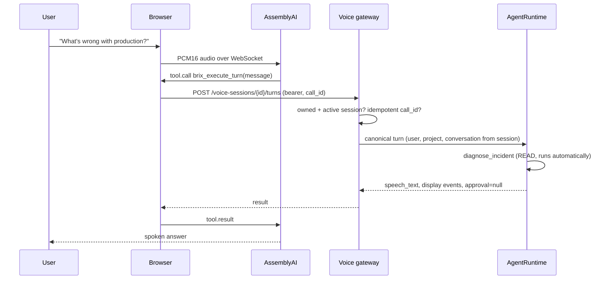
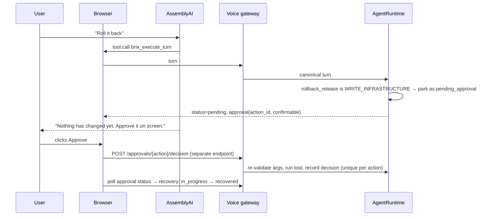

# Voice architecture

Voice Mode is an additional interface to the existing agent. It is not a new agent, a parallel
tool registry, or a second source of truth for conversation state.

## Responsibilities

AssemblyAI owns speech in, speech out, browser transport, turn detection and interruption.
InfraBrix owns user and project identity, conversation state, reasoning, tool choice, policy,
approvals and audit. The only thing that crosses the boundary is one high-level tool,
`brix_execute_turn(message)`, and its result.

## A read turn

## A change

The decision endpoint is not part of the provider bridge. Nothing AssemblyAI or the model produces
can call it. It requires the signed-in user, their own active voice session, an unexpired and
undecided parked action in that session's conversation, and a tool on the voice allow-list.

## Reconnection

Provider tokens are short-lived and single-use. On an unexpected socket close, the browser calls
`/reconnect`, which marks the old session `disconnected` and issues a new session and token on the
same conversation. A session the user ended cannot be resumed. The mic and audio graph stay open
across retries (3 attempts, 1s/2s/4s).

## Telemetry

Lifecycle events are audit entries: `voice.session.started|connected|reconnected|ended`,
`voice.turn`, `voice.approval.approved|denied|failed`, and client-reported `voice.client.*`. Client
events accept a fixed type and a code matching `^[a-z0-9_.-]+$`. Transcripts are stored in the
conversation, never in telemetry.

## Simulated cloud

`backend/app/democloud.py` gives each visitor a private, stateful environment: four services, a
release history, an incident introduced by the latest `ria-api` release, matching metrics and logs,
a cost summary, and a rollback that completes after `INFRABRIX_DEMO_ROLLBACK_SECONDS`. The tools in
`agent/tools.py` are the only code that touches it. In the InfraBrix product, the same tool
interface is backed by real cloud providers.
